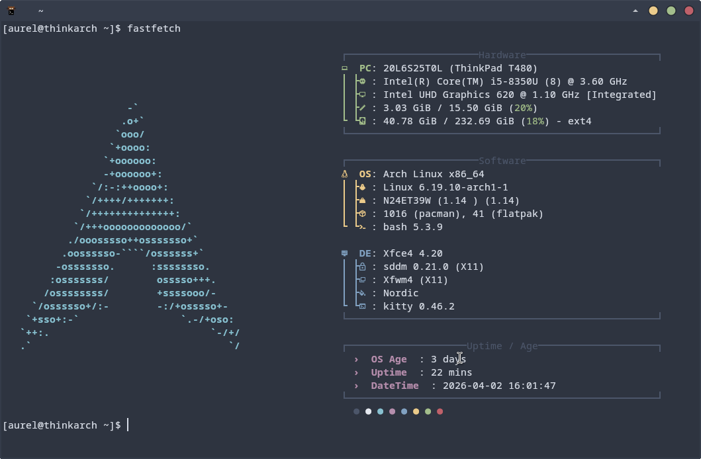

# myfastfetchconfig
a modified fastfetch config by RevalensK
inspiration by <a href='https://www.reddit.com/r/GarudaLinux/comments/1dcq0dl/making_fastfetch_more_beautiful_linux/?solution=bdedd599b2bf95debdedd599b2bf95de&js_challenge=1&token=bbbe4bf1c9a2b5160829c4be34da5861e8124294210720ad9f8ea2802a64c022'>this</a>



# how to install
First generate the config with 
```bash
fastfetch --gen-config
```
You can git clone the repo in your fastfetch config (~ /.config/fastfetch)
or just copy the text of the file into config.jsonc 
